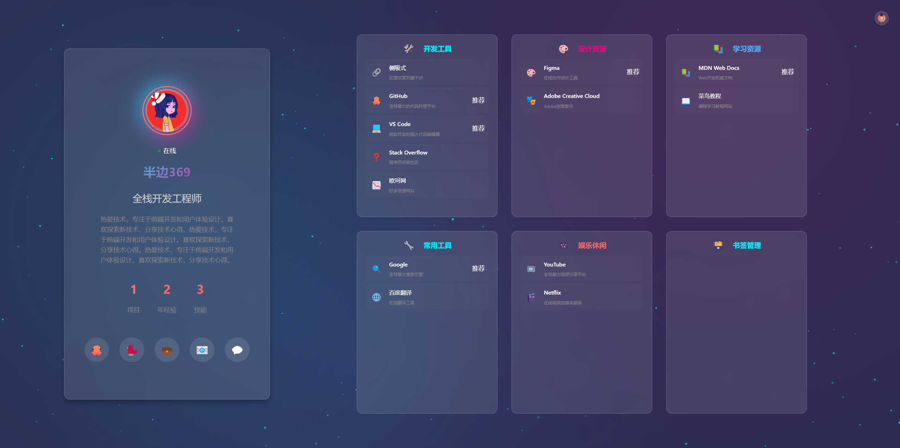
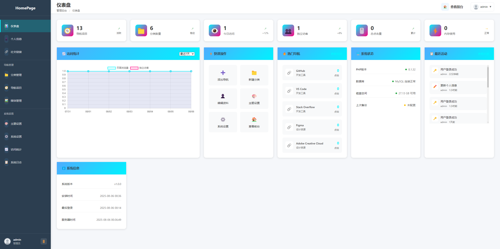

## 📖 HomePage 项目简介

HomePage 是一个全由AI写的个人导航及书签管理程序，包含完整的前后端系统，提供强大的管理后台和数据统计功能。

<div align="center">
  
  ### 🖥️ 前台预览
  
  
  ### ⚙️ 后台预览
  
  
</div>

## ✨ 主要特性

### 🎨 视觉设计
- **未来科技感界面** - 赛博朋克风格的视觉设计
- **多主题支持** - 内置5种精美主题（赛博朋克、极光、合成波、矩阵、霓虹）
- **动态粒子系统** - 智能粒子背景效果，支持鼠标交互
- **玻璃拟态效果** - 现代化的毛玻璃材质设计
- **丰富的动画特效** - 点击爆炸、悬停动画、过渡效果

### 🚀 功能特性
- **响应式设计** - 完美适配桌面端、平板和移动设备
- **PWA支持** - 可安装为桌面应用，支持离线访问
- **个人信息展示** - 头像、简介、统计数据、社交链接
- **导航分类管理** - 支持多级分类，自定义图标和颜色
- **点击统计** - 记录导航项目点击次数和访问统计
- **搜索功能** - 智能搜索导航项目（可选）

### 🛠️ 技术特性
- **纯原生开发** - 无框架依赖，轻量高效
- **PHP后端** - 完整的管理系统和API接口
- **MySQL数据库** - 结构化数据存储
- **一键安装** - 智能安装向导，快速部署
- **安全可靠** - 密码加密、SQL注入防护、XSS防护

## 🎯 主题展示

| 主题名称 | 特色 | 适用场景 |
|---------|------|----------|
| **赛博朋克** | 霓虹灯效果，青色+品红色配色 | 科技感、未来感 |
| **极光** | 流动渐变，蓝色系配色 | 优雅、梦幻 |
| **合成波** | 80年代复古风格，紫色+橙色 | 怀旧、复古 |
| **矩阵** | 数字雨效果，绿色终端风格 | 黑客、极客 |
| **霓虹** | 明亮对比色，红色+绿色 | 活力、动感 |

## 📋 系统要求

### 服务器环境
- **PHP** >= 7.4 (推荐 PHP 8.0+)
- **MySQL** >= 5.7 或 **MariaDB** >= 10.2
- **Web服务器** Apache/Nginx
- **PHP扩展** PDO、PDO_MySQL、JSON、GD

### 浏览器支持
- Chrome >= 80
- Firefox >= 75
- Safari >= 13
- Edge >= 80

## 🚀 快速安装

### 方法一：一键安装（推荐）

1. **下载项目文件**
   ```bash
   git clone https://github.com/zhi3344ai/HomePage.git
   cd HomePage
   ```

2. **上传到服务器**
   - 将所有文件上传到网站根目录
   - 确保 `admin/config/`、`admin/logs/`、`admin/uploads/` 目录可写

3. **运行安装向导**
   - 访问 `http://yourdomain.com/install.php`
   - 按照向导提示完成安装

4. **完成安装**
   - 前台访问：`http://yourdomain.com/`
   - 后台管理：`http://yourdomain.com/admin/`

### 方法二：手动安装

1. **创建数据库**
   ```sql
   CREATE DATABASE homepage CHARACTER SET utf8mb4 COLLATE utf8mb4_unicode_ci;
   ```

2. **导入数据库结构**
   ```bash
   mysql -u username -p homepage < database/data.sql
   ```

3. **配置数据库连接**
   - 复制 `admin/config/database.example.php` 为 `database.php`
   - 修改数据库连接信息

4. **设置目录权限**
   ```bash
   chmod 755 admin/config/
   chmod 755 admin/logs/
   chmod 755 admin/uploads/
   chmod 755 assets/images/
   ```

## 📁 目录结构

```
HomePage/
├── index.html              # 前台主页
├── install.php             # 安装向导
├── admin/                  # 管理后台
│   ├── index.php          # 后台入口
│   ├── login.php          # 登录页面
│   ├── config/            # 配置文件
│   ├── includes/          # 公共函数
│   ├── pages/             # 后台页面
│   ├── assets/            # 后台资源
│   ├── uploads/           # 上传文件
│   └── logs/              # 日志文件
├── api/                   # API接口
│   ├── index.php          # 主API
│   └── navigation.php     # 导航API
├── assets/                # 前台资源
│   ├── images/            # 图片文件
│   └── icons/             # 图标文件
├── css/                   # 样式文件
│   ├── main.css           # 主样式
│   ├── theme.css          # 主题样式
│   └── responsive.css     # 响应式样式
├── js/                    # JavaScript文件
│   ├── main.js            # 主脚本
│   ├── navigation.js      # 导航功能
│   ├── animations.js      # 动画效果
│   └── particles.js       # 粒子系统
├── config/                # 配置文件
│   ├── default.json       # 默认配置
│   └── links.json         # 链接配置
├── database/              # 数据库文件
│   └── data.sql           # 数据库结构
├── pwa/                   # PWA配置
│   ├── manifest.json      # 应用清单
│   └── service-worker.js  # 服务工作者
└── dev/                   # 开发工具
    └── package.json       # 开发依赖
```

## 🎮 使用指南

### 前台功能

1. **个人信息展示**
   - 头像、姓名、职业标题
   - 个人简介和统计数据
   - 在线状态显示

2. **导航分类浏览**
   - 按分类查看导航项目
   - 支持图标和颜色自定义
   - 点击统计和推荐标识

3. **主题切换**
   - 点击右上角主题按钮
   - 选择喜欢的视觉主题
   - 实时预览效果

4. **搜索功能**（可选）
   - 快捷键 `/` 或 `Ctrl+K` 聚焦搜索
   - 智能匹配导航项目
   - 支持键盘导航

### 后台管理

1. **登录系统**
   - 默认账号：`admin`
   - 默认密码：`admin123`
   - 一键安装时请填写自己喜欢的用户名和密码

2. **个人信息管理**
   - 修改头像、姓名、简介
   - 设置统计数据
   - 管理社交链接

3. **导航管理**
   - 创建和编辑分类
   - 添加导航项目
   - 设置图标和描述
   - 调整排序和状态

4. **主题设置**
   - 启用/禁用主题
   - 设置默认主题
   - 自定义主题颜色

5. **系统设置**
   - 网站基本信息
   - 功能开关设置
   - 性能优化选项

6. **统计分析**
   - 访问量统计
   - 点击热度分析
   - 用户行为数据

## 🔧 自定义配置

### 主题自定义

在 `css/theme.css` 中添加新主题：

```css
[data-theme="mytheme"] {
  --primary-color: #your-color;
  --secondary-color: #your-color;
  --background-color: #your-color;
  /* 更多颜色配置... */
}
```

### API接口

项目提供完整的REST API：

- `GET /api/?action=profile` - 获取个人信息
- `GET /api/?action=navigation` - 获取导航数据
- `GET /api/?action=categories` - 获取分类数据
- `POST /api/?action=click` - 记录点击统计

### 配置文件

- `config/default.json` - 默认配置
- `config/links.json` - 导航链接配置
- `admin/config/config.php` - 系统配置

## 🛡️ 安全特性

- **密码加密** - 使用 PHP password_hash() 函数
- **SQL注入防护** - 使用预处理语句
- **XSS防护** - 输出转义和内容安全策略
- **CSRF防护** - 表单令牌验证
- **文件上传安全** - 类型检查和路径限制
- **访问控制** - .htaccess 文件保护

## 📱 PWA功能

- **离线访问** - Service Worker 缓存策略
- **桌面安装** - 支持添加到主屏幕
- **推送通知** - 支持浏览器通知（可选）
- **自动更新** - 智能缓存更新机制

## 🔄 更新日志

### v1.0.0 (2025-01-26)
- 🎉 首次发布
- ✨ 完整的前后端系统
- 🎨 5种精美主题
- 📱 PWA支持
- 🛠️ 一键安装向导
- 📊 访问统计功能

## 🤝 贡献指南

欢迎提交 Issue 和 Pull Request！

1. Fork 本仓库
2. 创建特性分支 (`git checkout -b feature/AmazingFeature`)
3. 提交更改 (`git commit -m 'Add some AmazingFeature'`)
4. 推送到分支 (`git push origin feature/AmazingFeature`)
5. 开启 Pull Request

## 📄 开源协议

本项目基于 [MIT License](LICENSE) 开源协议。

## 🙏 致谢

- 感谢所有贡献者的支持
- 特别感谢开源社区的灵感
- 图标来源：Emoji 和自定义 SVG

## 📞 联系方式

- **作者**：半边
- **邮箱**：
- **项目主页**：https://github.com/zhi3344ai/HomePage
- **演示地址**：无

---

<div align="center">
  <p>如果这个项目对你有帮助，请给个 ⭐ Star 支持一下！</p>
  <p>Made with ❤️ by 半边</p>
</div>